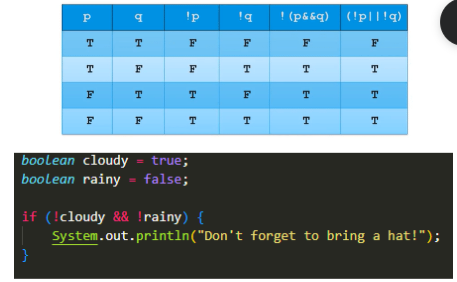

## Week 1

- Objects have **attributes** which are characteristics of an object
- A **class** is the blueprint that **objects** are created from. **Instantiating** an object calls the constrcutor to create an object.
- A **constructor** is code that has the same name as the class and tells the computer how to create a new object 

- **Parameter**: a variable in the method/constructor signature that defines the type of value to receive when the method or constructor is called
    - in the definition of a function
- **Argument**: a value passed to a method/constructor when the method or constructor is called
    - when calling the function

    # Collegeboard Unit Lessons 
> Unit Lesson Notes from Class Presentations 

- toc: true 
- badges: true
- comments: true
- categories: [jupyter]
- image: images/acorn.png
## Unit 1: Primitive Types 
- Primitives Example:
- [GPA Calculator](https://mann223.github.io/fastpages/jupyter/2022/08/25/primitiveHacks.html)

- Primitive Types
    - Boolean
    - Numeric
        - Character
            - char
        - Integral
            - Integer
                - byte
                - short
                - int
                - long
            - FLoating-point
                - float
                - double

- Wrapper Classes (Non-Primitive)
    - String, Array, etc.
    - Like an object so has methods

- Additional W1 Notes:
    - Input
        - `Scanner input;`
        - `input = new Scanner(System.in);`
        - `System.out.print("Enter an integer: ");`
        - `input.close();`
    - Output
        - `System.out.println();`
# Unit 2: Using Objects
# Unit 3: Booleans Expressions and if Statements

## Compound Boolean Expressions 
- De Morgan's Law - helps simplify boolean expressions
- `!(a&&b)= (!a || !b)`
- Truth tables to visualize Boolean identities

## Comparing Objects
- use `==` to see if two obj references are aliases for the same obj or to see if an obj is null
- use `.equals()` to see if the attributes of two obj are the same
# Unit 4: Iteration

## While Loops
- do something while a condition is true

int x = 5;

// The boolean expression in this case is x > 0
while (x > 0) {
    System.out.println(x);
    x--;
}
- while loops can be used to iterate over elements
int[] array = {3, 7, 0, 2, 4, 5, 9, 1, 3, 6, 3};
int total = 0;
int i = 0;

while (i < array.length) {
    total += array[i];
    i++;
}

System.out.println(total);
- infinite while loops - run over and over permanently since boolean condition true at all times
import java.util.Scanner;

Scanner input = new Scanner(System.in);
String choice;

while (true) {
    System.out.println("Would you like to continue: ");
    choice = input.nextLine();
    if (choice.equals("No")) {
        break;
    }
}
# Unit 5 Writing Classes
- Class - blueprint to create objects
    - instance variables/attributes (data)
    - constructors 
    - methods
        - accessors/getters
        - mutators/setters
        - main method (tester)

- Objects are instances of a class
- Methods are what an object can do
- `public` means it can be accessed outside the class
- `private` means its restricted to accessing it inside the class
- Constructors 
    - initialize instance variables when an object is created
public class Cow {

    // instance variables
    private String cowType;
    private String sound;
    private int numMilkings;

    // constructor
    public Cow (String cowType, String sound){
        this.numMilkings = 0;
        this.cowType = cowType;
        this.sound = sound;
    }

    public String getSound(){
        return sound;
    }
}    

public class CowDriver{
    public static void main(String[] args) {
        Cow myCow = new Cow("holstein", "moo");
        System.out.println(myCow.getSound());
        // myCow.sound = "bark!";
    }
}

CowDriver.main(null);
public class Song
{

  /** Verse - prints out a verse of the song
   * @param number - a String like "one", "two", etc.
   * @param rhyme - a String like "thumb", "shoe", etc.
   */
   public void verse(String number, String rhyme)
   {
     System.out.println("This old man, he played " + number);
     System.out.println("He played knick knack on my " + rhyme);
   }

  // The chorus method
  public void chorus()
  {
     System.out.println("With a knick knack paddy whack, give a dog a bone.");
     System.out.println("This old man came rolling home.");
  }

  public static void main(String args[])
  {
      Song mySong = new Song();
      mySong.verse("one", "thumb");
      mySong.chorus();
      mySong.verse("two", "shoe");
      mySong.chorus();
      mySong.verse("three", "knee");
      mySong.chorus();
      mySong.verse("four", "door");
      mySong.chorus();
  }
}

Song.main(null);
# Unit 6 Arrays
- Arrays Team Lesson
- [Traversing Arrays 6.2](https://mann223.github.io/fastpages/jupyter/2022/10/24/arrayLesson.html)
- [Team Lesson](https://pranaviinukurti.github.io/fastpagescsa/jupyter/2022/10/25/arrays-lesson.html)
